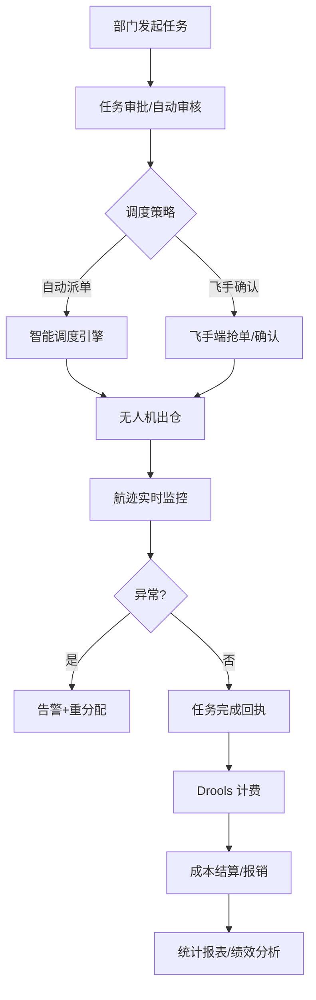

# 工业园区无人机协作调度系统项目说明

## 一、项目概述

- **项目背景**：针对大型智能制造产业园区物料配送效率低、设备巡检周期长、夜间/高温作业安全风险高的问题，联合园区运营方开展横向课题，建设一套“工业园区无人机协作调度系统”。
- **建设目标**：管理 10~15 架无人机与 3~5 名飞手，实现配送、巡检、应急保障等任务的统一调度、全程监控与精细化结算。
- **应用范围**：园区仓储中心、生产线、实验楼、维修车间等核心节点；支持日间+夜间、常规+加急、单任务+多任务等多种业务形态。

## 二、核心业务场景

| 场景 | 业务描述 | 技术需求 |
| --- | --- | --- |
| 生产物料配送 | 仓储中心 → 生产线的零部件、工具运输 | 精准调度、载荷评估、航迹实时可视 |
| 设备巡检 | 高温/高危区域的设备巡检、防火巡检 | 任务批调度、图像数据回传、异常告警 |
| 应急响应 | 突发事件的应急药品、安防物资配送 | 任务优先级抢占、加急航线规划 |
| 夜间值守 | 夜间防盗巡航、重点区域巡视 | 夜航管控、低电量重分配、灯光控制 |
| 数据采集 | 环境监测传感器数据回传 | 数据缓冲、断点续传、边缘计算扩展 |

## 三、系统功能总览

1. **无人机资产管理**
   - 台账管理：机型、载重、续航、固件版本、保养计划。
   - 实时状态：电量、电机状况、传感器告警、航姿信息。
   - 使用管控：飞行权限、任务等级边界、飞行时间统计。

2. **飞手与运营管理**
   - 企业微信内部登录，执照/工牌 OCR 实名认证。
  - 人脸识别确保飞手本人操作，签到与飞行日志留存。
  - 飞手排班、任务指派、绩效分析。

3. **任务全生命周期管理**
  - 标准化任务单：起点、终点、载荷、时间窗、优先级、飞行策略。
  - 审批流转：常规任务自动审核，应急任务快速提审。
  - 任务执行状态：创建 → 待调度 → 执行中 → 完成 → 结算归档。

4. **智能调度引擎**
  - 多维度匹配：位置距离、剩余续航、载重匹配、任务优先级、天气情况。
  - 支持自动派单/飞手确认两种模式。
  - 异常重分配：故障、低电量、天气变动触发任务迁移。

5. **实时监控与可视化**
  - 航迹实时渲染，支持高度、速度、姿态多维数据展示。
  - 禁飞区、临时管制区与预设航线叠加展示。
  - 异常事件实时推送，支持声音、短信、看板提醒。

6. **结算与成本管理**
  - 计费模型：基础任务费 + 飞行距离 + 载荷系数 + 时间系数。
  - Drools 严格定义费用规则，支持分部门、分任务类型差异化定价。
  - 成本归集：飞手劳务费、无人机维护基金、平台管理费多方分账。

7. **数据与报表中心**
  - 任务执行质量指标、资源利用率。
  - 消耗分析：电池寿命、故障率、维保费用预估。
  - 可导出月报、季报、年度对标分析。

## 四、系统架构设计

### 1. 技术栈

- **基础框架**：Spring Boot 3.x、Spring Cloud 2022.x、Spring Cloud Alibaba（Nacos、Sentinel、Seata、RocketMQ/RabbitMQ）。
- **数据存储**：MySQL + MyBatis-Plus、Redis、MongoDB、Elasticsearch。
- **规则与算法**：Drools 规则引擎、Redisson 分布式锁。
- **前端技术**：Vue 3 + Vite（运营后台、大屏监控）、UniApp（移动端飞手运营端）。
- **其他组件**：Knife4j OpenAPI、SkyWalking 链路追踪、Prometheus + Grafana 监控告警。

### 2. 微服务拆分

| 服务 | 职责说明 |
| --- | --- |
| `service-uav-pilot` | 飞手/无人机资产管理、资质认证、人脸识别 |
| `service-task-requester` | 部门/生产线任务发起、预算控制、审批流 |
| `service-delivery-task` | 任务生命周期管理、任务状态机 |
| `service-scheduling` | 调度引擎、任务派发、异常重分配 |
| `service-industrial-map` | 园区地图、航线规划、禁飞区管理 |
| `service-energy-rules` | Drools 规则引擎：费用、能耗、奖励、等级 |
| `service-billing` | 成本核算、账单分摊、内外部结算接口 |
| `service-monitor` | 航迹追踪、告警推送、监控大屏数据聚合 |
| `service-system` | 用户权限、组织架构、操作审计 |
| `gateway` | API 网关、安全校验、流量治理 |
| `web-ops-center` | 运营后台、可视化大屏 |
| `web-operator` | 飛手端移动应用 |
| `web-task-requester` | 部门任务发起端 |

### 3. 架构特性

- **事件驱动**：任务状态、飞手操作、异常告警统一通过 MQ 分发，提高系统解耦与响应速度。
- **规则动态化**：Drools 规则在线热更新，无需重启服务即可调整计费与调度策略。
- **容灾设计**：关键服务多实例部署 + Sentinel 限流熔断、Redis 缓存削峰、Seata/最终一致性处理关键事务。
- **安全治理**：OAuth2 + JWT 鉴权、接口签名、数据脱敏、日志审计、敏感操作告警。

## 五、核心业务流程（示例）

## 六、关键算法设计

1. **调度引擎**
   - 指标权重：距离、续航、电量、载荷、任务等级、历史故障率、天气影响指数。
   - 算法策略：多指标加权评分 + 黑名单过滤 + 动态调整阈值。
   - 支持回退机制：调度失败/飞手拒绝 → 回到候选队列重分配。

2. **Drools 规则引擎**
   - 计价规则示例：
     - 基础任务费：按任务类型（配送/巡检/应急）。
     - 里程费：按航线长度阶梯计价。
     - 能耗补偿：电池循环次数、负载等级。
     - 优先级加价：加急/夜航附加系数。
   - 激励规则：
     - 完成率、准时率、故障响应速度影响绩效奖金。
     - 任务高峰期补贴。

3. **异常处理逻辑**
   - 航迹偏离：阈值 > 50m 触发预警，>100m 触发强制召回。
   - 电量异常：剩余电量与飞行距离比值低于阈值自动返航。
   - 天气突变：气象 API 接入，超阈值自动暂停任务并通知人工干预。

## 七、数据模型（关键表）

| 表名 | 说明 | 关键字段 |
| --- | --- | --- |
| `uav_info` | 无人机主数据 | 机型、续航、载重、固件、状态 |
| `uav_pilot` | 飞手信息 | 资质证件、排班、评分、人脸模型 |
| `task_info` | 任务表 | 起终点、载荷、优先级、时间窗、状态 |
| `task_trajectory` | 航迹数据 | 时间戳、经纬度、高度、速度、姿态 |
| `task_event_log` | 异常/状态日志 | 事件类型、触发条件、处理结果 |
| `billing_record` | 费用记录 | 任务费用、分摊明细、结算状态 |
| `rule_snapshot` | 规则版本表 | 规则名称、版本号、生效时间 |
| `maintenance_plan` | 保养计划 | 周期、项目、执行状态 |

## 八、监控与运维

- **指标监控**：飞行成功率、平均响应时间、平均任务时长、雨天取消率、夜航占比。
- **资源监控**：无人机剩余电量分布、飞手在线状态、任务排队长度。
- **告警机制**：任务超时、电池温度异常、飞手未签到、MQ 堆积、服务响应超时。
- **可视化**：Grafana/大屏仪表盘展示生产效率、能源消耗、故障分布。

## 九、项目实施成效

- **效率提升**：配送响应时间从 30 分钟降至 6 分钟，巡检频率提升 4 倍。
- **安全收益**：降低高温/夜间人工作业风险，提升园区运营安全等级。
- **成本效益**：年度人工+车辆成本节约 40%，无人机投入回收期 < 18 个月。
- **数据资产**：形成任务执行、故障、能耗等多维数据，为后续 AI 优化提供基础。

## 十、个人贡献与技术亮点（简历可引用）

- 负责工业园区无人机协同调度平台的微服务架构设计与实现，完成飞手认证、任务管理、调度引擎、实时监控、成本结算等核心功能模块落地。
- 主导调度算法与 Drools 规则引擎集成，实现“距离+续航+载荷+优先级”的动态调度策略和“任务类型+里程+能耗+等级”的灵活计费模型，支持在线热更新。
- 构建基于 Nacos + MQ 的事件驱动机制，覆盖任务重分配、异常告警、财务结算等业务场景，保障系统在高并发/异常情况下的稳定性。
- 构建可观测性体系（日志、链路、指标、告警），并设计运营大屏与数据分析报表，为园区运营决策提供可量化数据支撑。

## 十一、面试问答准备

1. **系统调度如何兼顾效率与安全？**
   - 通过续航、电量、载荷、任务等级等多指标评分，结合禁飞区和天气约束，确保调度合理性。
   - 设定异常触发机制：偏航、低电量、风速异常时自动重分配或召回。

2. **为何采用 Drools？**
   - 计费、激励、能耗补偿等规则变化频繁，Drools 支持业务侧快速配置和热更新，避免频繁改代码。
   - 与调度引擎联动，可快速调整优先级、补贴策略，实现精细化运营。

3. **如何扩展至更多智能体（例如 AGV）？**
   - 现有架构通过 service-client 模块隔离服务调用协议，调度引擎可扩展模式参数，实现混合智能体调度。
   - MQ 事件总线、规则引擎均具有可扩展性，适配不同设备类型。

4. **系统可靠性措施有哪些？**
   - 服务层：Sentinel 限流熔断 + 多副本部署。
   - 数据层：Redis 缓存兜底、数据库备份、MQ 消息确认机制。
   - 应用层：任务状态幂等处理、重试机制、异常补偿任务。

5. **未来优化方向？**
   - 引入强化学习/蚁群算法进行自主调度优化；
   - 结合园区数字孪生系统，实现虚实联动；
   - 扩展边缘计算节点，减少航迹数据回传延迟。

---

该文档可直接用于对外汇报、简历撰写与面试答辩准备，也可作为项目实施说明书的框架基础。若需导出为英文版或 PPT 版，可在此结构基础上进一步加工。
